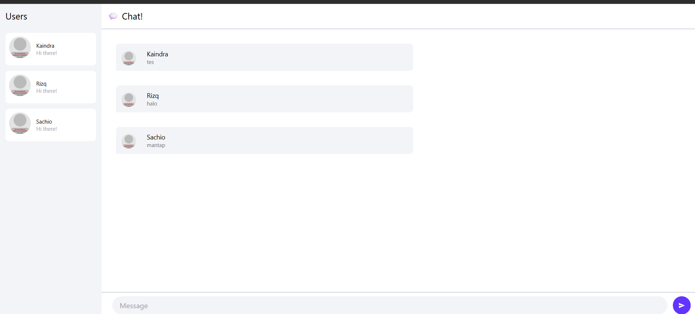
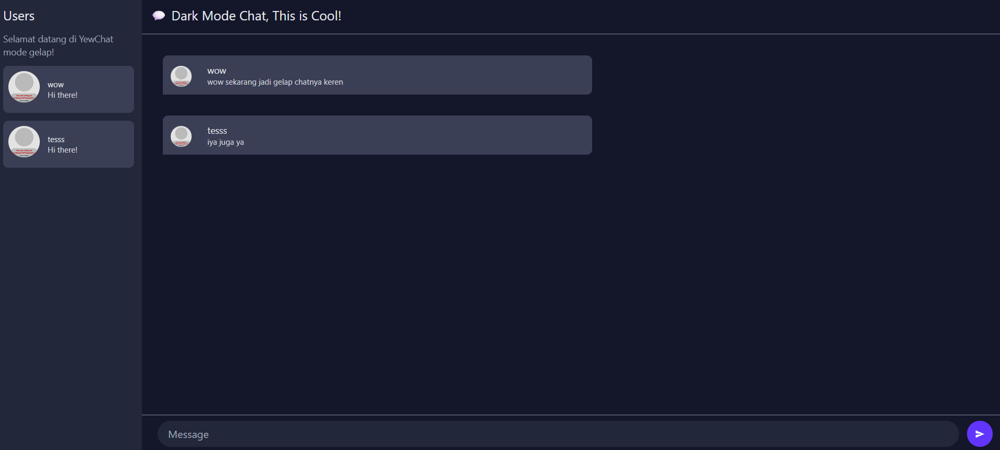

# Module 10 - Asynchronous Programming

## Tutorial 3 - WebChat

### 3.1 Original Code

### 3.2 Add some Creativities to The Webclient

Pada modifikasi ini, saya mengubah tampilan aplikasi Chat menjadi mode gelap dengan memanfaatkan fitur darkMode: 'class' dari Tailwind CSS dan menambahkan kelas-kelas seperti dark:bg-gray-900 dan dark:text-gray-200 pada elemen-elemen utama. Selain perubahan warna, teks judul di bagian atas chat juga diperbarui menjadi "💬 Dark Mode Chat, This is Cool!" untuk memberikan nuansa menyenangkan.